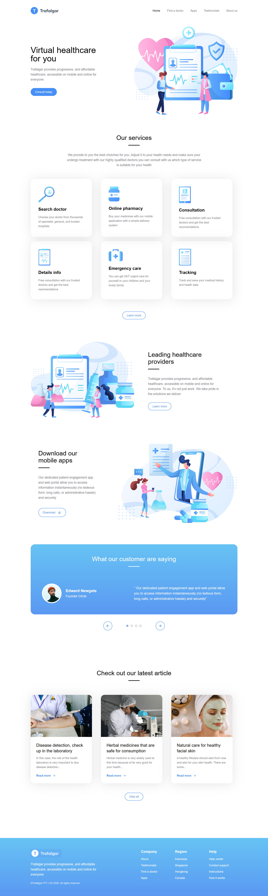

# Trafalgar Landing Page

Une landing page moderne et responsive pour une plateforme de santé digitale, développée avec SvelteKit et Tailwind CSS.

## 📸 Aperçu du projet



## ✨ Fonctionnalités

- **Design responsive** - Optimisé pour tous les appareils (mobile, tablette, desktop)
- **Interface moderne** - Design clean avec des gradients et animations fluides
- **Carrousel de témoignages** - Navigation interactive avec flèches et indicateurs
- **Sections dynamiques** - Hero, services, témoignages, footer
- **Animations CSS** - Transitions et hover effects
- **Performance optimisée** - Bundle léger avec SvelteKit

## 🛠️ Technologies utilisées

- **[SvelteKit](https://kit.svelte.dev/)** - Framework JavaScript moderne
- **[Tailwind CSS](https://tailwindcss.com/)** - Framework CSS utilitaire
- **[Iconify](https://iconify.design/)** - Bibliothèque d'icônes
- **Vite** - Build tool rapide
- **HTML5/CSS3** - Standards web modernes

## 🚀 Installation et lancement

### Prérequis
- Node.js (version 16 ou supérieure)
- npm ou yarn

### Installation
```bash
# Cloner le repository
git clone https://github.com/NitiemaAllassane/trafalgar-site.git

# Naviguer dans le dossier
cd trafalgar-landing-page

# Installer les dépendances
npm install
```

### Développement
```bash
# Lancer le serveur de développement
npm run dev

# Ouvrir http://localhost:5173 dans votre navigateur
```

### Build de production
```bash
# Créer le build optimisé
npm run build

# Prévisualiser le build
npm run preview
```

## 📁 Structure du projet

```
src/
├── lib/
│       ├── Hero.svelte
│       ├── Services.svelte
│       ├── Testimonials.svelte
│       ├── Footer.svelte
│       └── UnderlineTitle.svelte
├── assets/
│   ├── images/
```

## 🎨 Personnalisation

### Couleurs
Les couleurs principales sont définies dans `tailwind.config.js` :
```css
@theme {
    /* color */
    --color-primary: #458FF6;
    --color-gray-500: #7D7987;
    --color-gradient-start: #67C3F3;
    --color-gradient-end: #5A98F2;

    --font-mulish: 'Muslish', sans-serif;
    --font-weight-md: 500;
    --font-weight-regular: 400;
    --font-weight-bold: 600;

    --text-md:  1.125rem;

    --breakpoint-md: 770px;
}

@layer base {
    p {
        line-height: 1.6;
    }

    img {
        max-width: 100%;
    }

    body {
        font-family: var(--font-mulish);
        background-color: #fff;
        color: #000;
    }

h1, h2, h3, h4 {
        line-height: 1.5;
    }

}
```

### Composants
Chaque section est un composant Svelte réutilisable dans `src/lib/`.

## 📱 Responsive Design

- **Mobile First** - Design optimisé pour mobile puis adapté aux écrans plus larges
- **Breakpoints Tailwind** - sm, md, lg, xl
- **Grid et Flexbox** - Layout flexible et moderne

## 🌟 Fonctionnalités principales

### Hero Section
- Call-to-action prominent
- Illustration médicale
- Design gradient attractif

### Section Services
- Grid responsive des services
- Icônes et descriptions
- Hover effects

### Carrousel de témoignages
- Navigation par flèches
- Indicateurs radio buttons
- Transitions fluides

### Footer
- Liens organisés par catégories
- Informations de contact
- Design cohérent avec le site

## 👨‍💻 Auteur

**Votre Nom**
- GitHub: [@NitiemaAllassane](https://github.com/NitiemaAllassane)
- LinkedIn: [Nitiema Allassane](https://www.linkedin.com/in/allassane-nitiema-400a5835a/)

## 🙏 Remerciements

- Design inspiré des meilleures pratiques UX/UI
- Icônes fournies par [Iconify](https://iconify.design/)
- Framework CSS par [Tailwind CSS](https://tailwindcss.com/)

---

⭐ N'hésitez pas à donner une étoile si ce projet vous a plus 🙂!